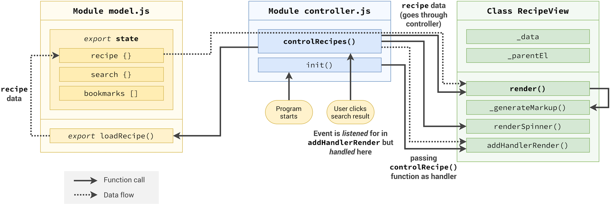

# Forkify - Recipe Searching & Bookmarking App

Forkify is a recipe searching, bookmarking, and uploading web application. Users can search recipes from an API, bookmark favorite recipes, and upload their own recipes.

## Table of Contents
1. [Features](#features)
2. [Demo](#demo)
3. [Screenshots](#screenshots)
4. [Technologies Used](#technologies-used)
5. [Setup](#setup)
6. [Usage](#usage)
7. [API Information](#api-information)
8. [Flowchart](#flowchart)

## Features

- Search for thousands of recipes via an API.
- Bookmark recipes for quick access.
- Add and upload new recipes.
- Pagination for large search results.
- Responsive design.
- Uses LocalStorage to persist bookmarks.

## Demo

Check out the live demo of the app: [Live Demo Link](your-live-link-here)

## Screenshots
##
### architecture of recipe loading

### Recipe Search Flow

### Bookmarking Flow

### Recipe Upload Flow

## Technologies Used

- JavaScript (ES6+)
- HTML5 & SCSS
- Parcel (bundler)
- Forkify API
- LocalStorage

## Setup

# 1. Clone the repository:
git clone https://github.com/your-username/forkify-app.git

# 2. Navigate to the project folder:
cd forkify-app

# 3. Install dependencies:
npm install

# 4. Start the development server:
npm start

# 5. Open http://localhost:1234 in your browser to view the app.

## Usage

### Searching Recipes
- Type a keyword in the search bar to find recipes.
- Browse through the paginated results.
- Click a recipe to view the full details.

### Bookmarking Recipes
- Click the bookmark icon on a recipe to save it.
- Access saved bookmarks from the bookmarks menu.

### Adding New Recipes
- Click "Add Recipe".
- Fill out the form (Title, Source URL, Image URL, Publisher, Cooking time, Servings, Ingredients).
- Submit to upload your recipe.

## API Information
Forkify uses the Forkify API to fetch recipe data. Include your API key when making requests:

- **Example Endpoint:**
https://forkify-api.herokuapp.com/api/v2/recipes?key=<your-api-key>
## Flowcharts

The following flowcharts represent the app flow for searching recipes, bookmarking, and uploading new recipes:

### Search Recipes Flow

### Bookmarking Flow

### Uploading Recipes Flow

